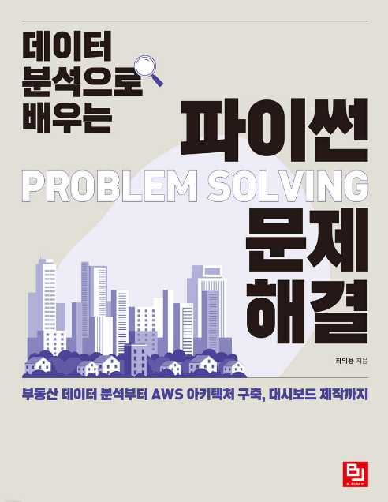

# 데이터 분석으로 배우는 파이썬 문제 해결

부동산 데이터 분석부터 AWS 아키텍처 구축, 대시보드 제작까지

논리적인 코드 같은데 왜 에러 메시지가 나타날까? 부동산 관련 다양한 공공 데이터를 수집하고 분석해보며 파이썬으로 데이터를 엔지니어링할 때 자주 보이는 에러와 에러 발생 이유, 그리고 문제를 해결하는 방법을 꼼꼼하게 살펴봅니다. 실제 데이터 분석 실무에서 진행하듯 공공 데이터를 가져와 전처리한 후 분석하고, 스트림릿을 활용해 시각화해봅니다. 또한, 애플리케이션으로 배포하는 것을 목표로 차근차근 AWS 아키텍처를 구축하고 보기 좋고 유의미한 대시보드를 제작합니다. 파이썬을 활용한 데이터 엔지니어링과 시각화, 그리고 대시보드 제작과 애플리케이션 배포까지 전 과정을 문제 해결의 시각으로 바라볼 수 있습니다.

---

- 저자 이메일: shjj08@gmail.com
- 질의응답 오픈채팅방: [데이터 분석으로 배우는 파이썬 문제 해결 질의응답](https://open.kakao.com/o/gHsN6c3f)

 
